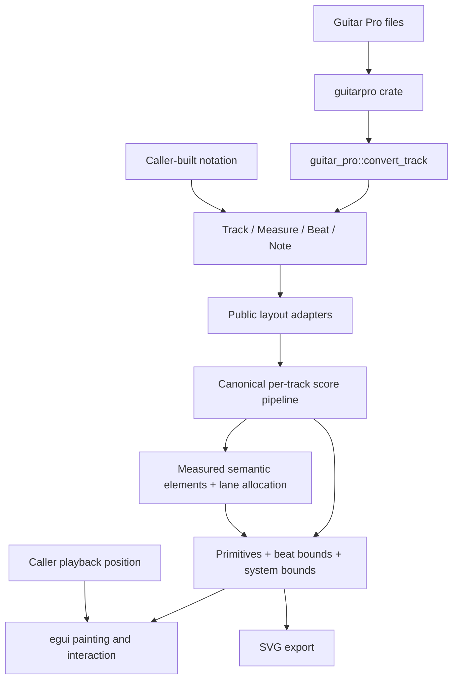
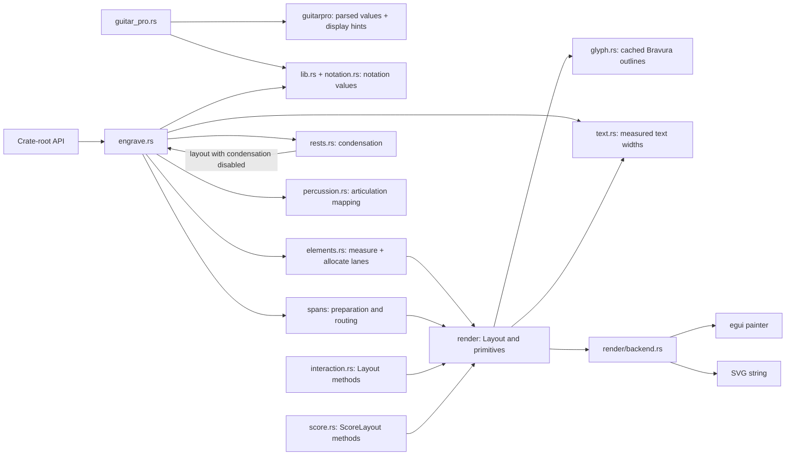
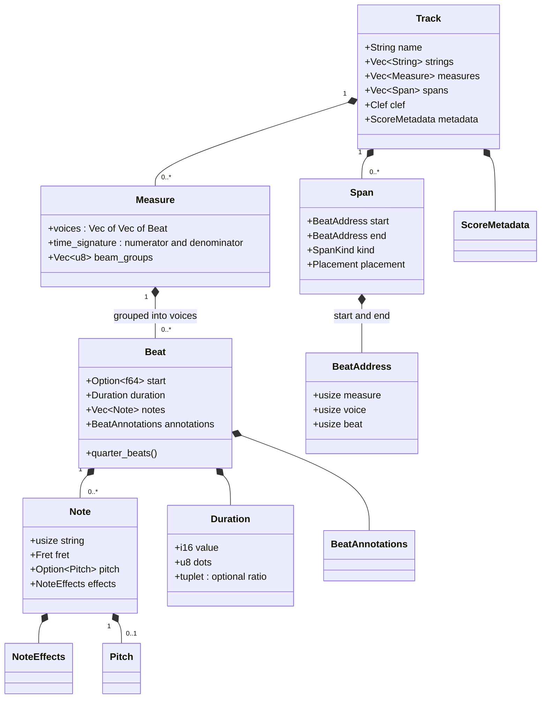
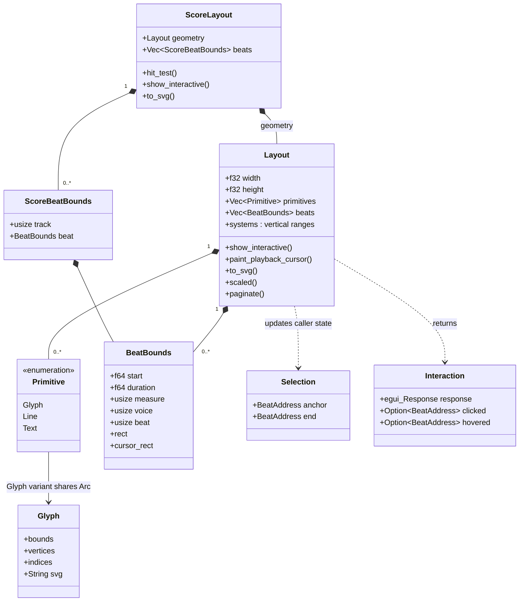
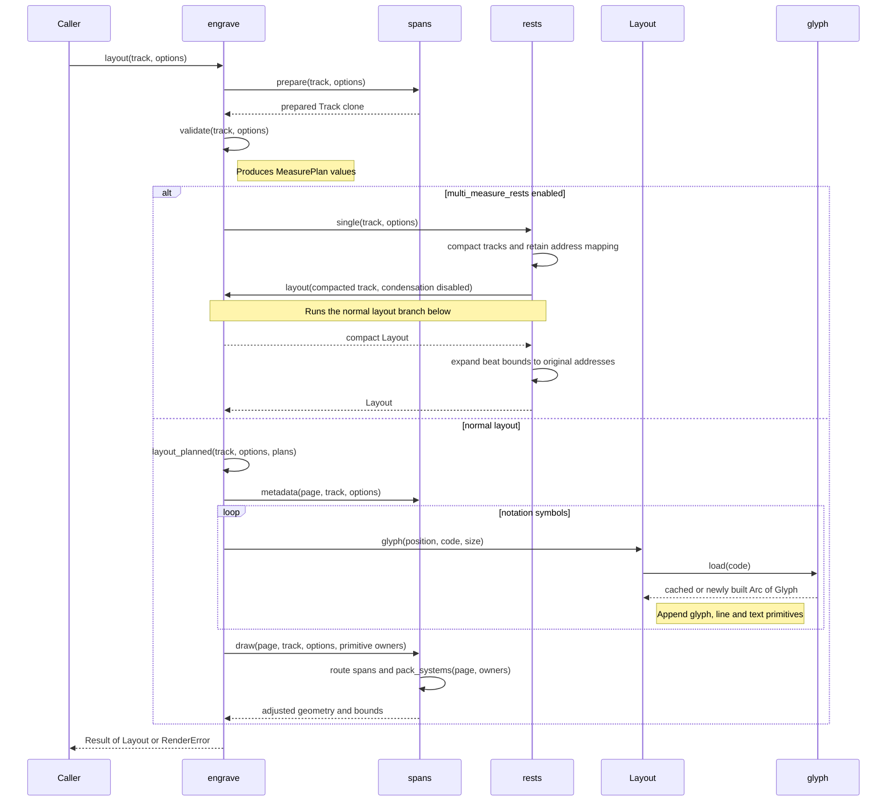
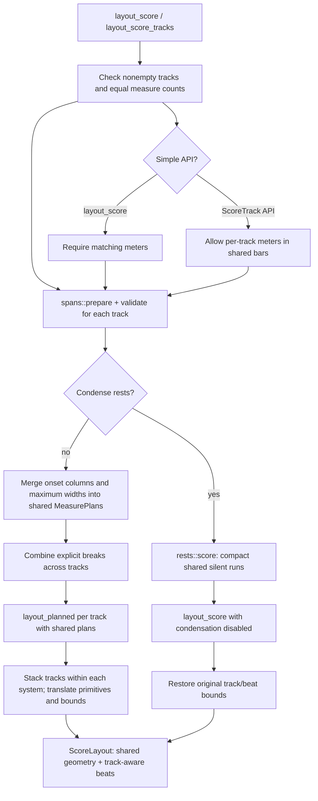

# Architecture

`alphatab-rs` is a synchronous Rust engraving library with native egui painting
and SVG export. It owns notation geometry and interaction helpers. The caller
owns files, application state, layout invalidation, selection state and playback.
See [features](FEATURES.md) and [upstream differences](ALPHATAB_DELTA.md).

## Data flow



The adapter returns `Result<ImportReport, RenderError>`; `ImportReport` contains
the converted track and warnings. Loading bytes is delegated to `guitarpro` by
the application or example. No Guitar Pro decoder lives in this crate.

## Source map

| Module | Responsibility |
| --- | --- |
| [lib.rs](../src/lib.rs) | Public exports, track/measure/beat/note/duration model and `RenderError`. |
| [notation.rs](../src/notation.rs) | Pitch spelling, clefs, notation modes, effects, annotations, diagrams, metadata and spans. |
| [guitar_pro.rs](../src/guitar_pro.rs) | Public Guitar Pro adapter entry point; delegates measure conversion, lyrics, display hints, and native-track assembly. |
| [guitar_pro/measures.rs](../src/guitar_pro/measures.rs) | Convert Guitar Pro measures, voices, beats, notes, effects, annotations, and structural marks. |
| [guitar_pro/helpers.rs](../src/guitar_pro/helpers.rs) | Normalize parser durations, repeat counts, beam groups, frets, fingerings, and harmonics. |
| [engrave.rs](../src/engrave.rs) | Single-track layout coordinator and system traversal. |
| [engrave/planning.rs](../src/engrave/planning.rs) | Input validation, onset-column measurement and per-measure plans. |
| [engrave/systems.rs](../src/engrave/systems.rs) | Page width, justification, notation extents and system headroom. |
| [engrave/measure.rs](../src/engrave/measure.rs) | Staff/tab frames, barlines, signatures, directions, repeats and measure rests. |
| [engrave/voices.rs](../src/engrave/voices.rs) | Beat placement, note connections, voice rhythm and interactive beat bounds. |
| [engrave/rhythm.rs](../src/engrave/rhythm.rs) | Rests, rhythmic noteheads, beams, flags and tuplets. |
| [engrave/staff.rs](../src/engrave/staff.rs) | Staff geometry, clefs, keys, accidentals, noteheads and stems. |
| [engrave/annotations.rs](../src/engrave/annotations.rs) | Measured beat annotations, note effects, bends and chord diagrams. |
| [engrave/numbered.rs](../src/engrave/numbered.rs) | Numbered-notation pitch and rhythm rendering. |
| [engrave/score_layout.rs](../src/engrave/score_layout.rs) | Synchronized tracks, instruments, documents and score stacking. |
| [elements.rs](../src/elements.rs) | Measured music/text elements, semantic groups, shared engraving metrics and bounds-driven annotation lanes. |
| [spans.rs](../src/spans.rs) | Shared span addressing, anchors, metadata, and span-module façade. |
| [spans/preparation.rs](../src/spans/preparation.rs) | Display transformations, endpoint validation, automatic span derivation, range grouping, and visibility filtering. |
| [spans/drawing.rs](../src/spans/drawing.rs) | Route and draw beams, slurs, effect bands, curves, and system packing. |
| [rests.rs](../src/rests.rs) | Condense eligible silent measures and restore original beat addresses in the resulting geometry. |
| [render.rs](../src/render.rs) | Layout options, layout state, primitive construction, beat bounds, interaction geometry, and pagination. |
| [render/primitive.rs](../src/render/primitive.rs) | Primitive-owned bounds and collision geometry. |
| [render/backend.rs](../src/render/backend.rs) | egui painting and SVG serialization backends. |
| [glyph.rs](../src/glyph.rs) | Parse bundled Bravura outlines, tessellate meshes and cache mesh/path data. |
| [music_font.rs](../src/music_font.rs) | Parse matched Bravura SMuFL metadata and translate glyph metrics into renderer coordinates. |
| [text.rs](../src/text.rs) | Measure proportional text using a shared default egui font context. |
| [percussion.rs](../src/percussion.rs) | Resolve articulation IDs into written positions and notehead glyphs. |
| [interaction.rs](../src/interaction.rs) | Single-track selection, cursor interpolation/following, scaling and pagination. |
| [score.rs](../src/score.rs) | Multi-track geometry and interaction preserving track identities. |
| [async_layout.rs](../src/async_layout.rs) | Revision-tagged background engraving with queued-request coalescing. |
| [export.rs](../src/export.rs) | Portable outlined-text SVG plus PNG and vector-PDF conversion. |
| [validation.rs](../src/validation.rs) | Reusable model validation and public resource limits, called explicitly or by layout. |

Internal modules are private except `guitar_pro` and `percussion`; public model,
layout and interaction types are re-exported at the crate root.

### Layout API layers

The layout entry points are input adapters rather than parallel renderers:

- `layout` engraves one `Track` directly.
- `layout_score` validates its homogeneous track slice, handles its dedicated
  shared-rest case, and converts the remaining work to `ScoreTrack` values.
- `layout_score_tracks` is the canonical synchronized multi-track pipeline. It
  prepares tracks, merges onset plans once, renders each staff against those
  plans, and stacks their systems.
- `layout_instruments` adds visual groups around that synchronized result.
- `layout_document` maps instruments, staves and master bars into the same
  per-track pipeline before adding cross-staff spans.

These layers preserve convenient input shapes; they are not compatibility
implementations for different alphatab-rs versions. There are no deprecated
model aliases or version-selected renderer paths.

### Reviewer guide and intended entry points

Read the crate in data-flow order rather than opening the largest engraver
module first:

1. Start with `lib.rs` and `notation.rs` to learn the public model and its
   contracts (`Track`, `Measure`, `Beat`, `Note`, `Span`, and `RenderError`).
2. Follow the simple path `Track -> layout -> measure planning -> engraving ->
   Layout -> backend`. This is the shortest route through the renderer.
3. Follow imported data separately: `convert_track` delegates to
   `guitar_pro/measures.rs`, then applies lyrics and builds the native `Track`.
4. Read `spans/preparation.rs` before `spans/drawing.rs`: preparation mutates a
   rendering copy and establishes the span invariants consumed by routing.
5. Read `rests.rs` and `score_layout.rs` for address preservation and shared
   system alignment, then inspect `score_layout/document.rs` for master bars and
   cross-staff spans.
6. Finish with `render/backend.rs`, `interaction.rs`, `score.rs`, and
   `async_layout.rs` for output, selection, playback cursors, and background
   work.

The intended public entry points are:

| Use case | Entry point | Intended ownership boundary |
| --- | --- | --- |
| Caller-built single track | `layout(&track, options)` | The caller owns the model and invalidates/rebuilds layouts. |
| Parsed Guitar Pro track | `guitar_pro::convert_track(&song, &track)` followed by `layout` | `guitarpro` owns decoding; this adapter owns conversion warnings and native notation values. |
| Homogeneous multi-track score | `layout_score(&tracks, options)` | Convenience validation and adaptation; synchronized rendering is delegated to the canonical score pipeline. |
| Per-track display settings | `layout_score_tracks(&score_tracks)` | Tracks share geometry/system constraints but may differ in notation visibility and mode. |
| Instrument groups/braces | `layout_instruments(&score_tracks, &groups)` | Adds visual grouping after synchronized staff layout. |
| Native staff/master-bar document | `layout_document(&document)` | Maps local staff measures to master bars, then adds cross-staff connections. |
| Background layout | `LayoutWorker` | The caller owns revisions and discards stale results. |
| Painting/export | `Layout::show`, `Layout::to_svg`, `ScoreLayout::show`, and export helpers | The layout owns geometry; the caller owns UI state, selection, playback, and file output. |

When reviewing a change, ask which invariant the stage establishes. The most
important ones are: musical addresses remain stable through condensation,
pagination, and score stacking; invalid pitches/durations/endpoints become
structured errors; parser losses become warnings where recoverable; and egui
and SVG consume the same primitive geometry. A useful review sequence is:

```text
public model
  -> single-track layout
  -> Guitar Pro adapter
  -> span preparation and drawing
  -> rest projection and score alignment
  -> rendering backends
  -> interaction, async layout, and export
  -> behavior-focused tests and error paths
```

Tests are organized by behavior rather than implementation file: `import.rs`
covers parser fidelity, `rendering.rs` covers notation/layout/backends,
`advanced.rs` covers spans, score layouts, rests, and interaction, and
`hardening.rs` covers limits, finite geometry, and worker lifecycle.

The Guitar Pro adapter does contain source-version normalization. Named helpers
at its boundary normalize repeat counts, GP5 beam groups and durations before
the renderer sees them. The call through `guitarpro`'s `optimized::legacy`
namespace belongs to that dependency's public conversion API and supplies
otherwise-private display hints; it is not an alphatab-rs legacy layer.

### Module collaboration

Arrows show calls or data use, not Rust module visibility. `interaction.rs` and
`score.rs` add methods to the public layout types rather than defining separate
rendering services.



## Model and timing

### Musical ownership hierarchy

The public model separates musical time from simultaneous sound events:

```text
Track
└── measures
    └── voices
        └── beats
            └── notes
```

`Track` owns measures in written order. A `Measure` is one shared time interval
with one or more independent voices. Each voice is a sequential beat stream;
beats from different voices are aligned by their onset within the measure.
Each `Beat` represents one rhythmic event and owns the notes sounding together
at that event. An empty note list represents a rest.

```text
Measure
├── Voice 0
│   ├── Beat 0: [Note, Note, Note]  // chord
│   └── Beat 1: [Note]
└── Voice 1
    └── Beat 0: [Note]
```

One `Note` carries the representations and details of a single event:

```text
Beat
└── notes: Vec<Note>
    ├── fret: Fret
    ├── pitch: Option<Pitch>
    └── effects, string, percussion...
```

`Fret` is the tablature state (`Number`, `Dead`, or `Tied`). `Pitch` is the optional written staff pitch, while
`effects`, `string`, and `percussion` provide articulation, placement, and
unpitched-instrument information. These are alternate views of one note, not
three separate sound events.

A `Track` owns measures, metadata, tuning labels, capo and explicit spans.
Each `Measure` owns multiple voices, each a sequence of `Beat` values. A beat
owns simultaneous notes and annotations. This is a rendering model, not the
upstream Score/Track/Staff object hierarchy or a playback event graph.

String numbering starts at 1 from the top. `Beat::start`, when present, is an
onset in quarter-note units relative to its measure; otherwise beats follow the
previous beat. `Beat::quarter_beats()` includes dots and nested tuplets.
`Duration::value` uses -4 for longa, -2 for breve and positive powers of two
through 256. Beat bounds carry musical start/duration independently of pixels.

`BeatAddress` identifies measure, voice and beat; `ScoreBeatAddress` adds track.
These are indices into the supplied model, not persistent IDs across arbitrary
edits. Rebuild layouts and reconcile selections when indices change. Rest
condensation preserves original addresses rather than exposing compact indices.

### Core structs and ownership

This diagram selects the main fields; it is not a complete API listing.
Composition diamonds mean owned values. There is no `Voice` struct: voices are
nested vectors. Span endpoints and selections hold addresses, not note references.



### Geometry and interaction types

`ScoreLayout::geometry.beats` is not the track-aware beat store; use
`ScoreLayout::beats`. A glyph primitive shares cached outline data through `Arc`.
Selection and interaction objects are managed by the caller and are not owned
by the layout.



## Layout stages

1. Prepare a cloned track: validate explicit spans, derive connections/grouped
   effects, and adapt slash notation without changing the caller's model.
2. Validate dimensions, durations, pitches, diagrams and grouping, and calculate
   measure plans with onset columns and minimum spacing.
3. Optionally condense eligible silent runs. This delegates to layout with
   condensation disabled and expands hit regions back to original addresses.
4. Choose system breaks, respecting flow, width, explicit breaks and bar limits;
   emit staff lines, symbols, text, rhythms and beat/cursor bounds.
5. Draw cross-beat/system spans and expand system spacing around actual extents.

`layout_score` preserves the original simple API and requires matching meters.
`layout_score_tracks` accepts `ScoreTrack` values with per-track display and
visibility options, and can combine different meters when tracks share the same
measure partition. `layout_instruments` adds named brace/bracket groups over
consecutive tracks. All score layouts share system breaks and preserve track-aware
bounds in `ScoreLayout::beats`.

Width is a preference unless `strict_width` is enabled: dense measures can make
the layout wider. Pagination slices complete systems and returns an error when
a system cannot fit; it does not re-engrave a system to fit page height.
`Layout::paginate_with_headers` additionally reserves title/footer space.

### Single-track layout call sequence

Calls shown below are real implementation entry points. Errors propagate to the
caller as `RenderError`; the success path is shown to keep the diagram readable.
Condensation re-enters layout exactly with that option disabled, avoiding an
unbounded recursion.



### Multi-track layout call flow

The shared plans align both horizontal onset positions and system breaks. Each
track is engraved separately before its systems are stacked into score geometry.



## Painting, fonts and caching

`Layout` contains a flat list of `Primitive::Glyph`, `Line`, `Curve` and `Text`
values. The flat list is the backend boundary, not the engraving model:
`MeasuredElement` values first measure Bravura or ordinary text geometry, semantic
groups combine related marks, and `LaneStack` assigns non-overlapping rows above
or below the notation. System headroom and depth use those same measurements.
Ties, slurs and bends remain cubic Bézier primitives through painting, SVG,
scaling and pagination instead of being flattened during engraving.
Each primitive can override its class color from `RenderStyle`; callers can set
an individual override by index. The same list feeds egui and SVG. Painting skips vertically clipped primitives;
layout still computes the whole requested score.

Bravura's OTF and matching font-specific SMuFL JSON are embedded with
`include_bytes!`. The `smufl` crate parses the metadata once. Engraving uses
`smufl::Glyph` as the canonical symbol identity, so semantic notation maps
directly to the font without a Unicode-to-glyph reverse table. Visible bounds
come from the tessellated OTF outline, which is the geometry that egui and SVG
actually draw. This deliberately avoids maintaining a second visual geometry
from the metadata bounding boxes. SMuFL metadata remains authoritative for
semantic information: advance widths, notehead stem anchors and recommended
line thicknesses. Beat-centered symbols use the center of their actual visible
bounds, so asymmetric side bearings do not move them away from their musical
anchor. The raw-origin placement API is named `glyph_at_origin` and is reserved
for symbols such as flags and clefs whose SMuFL origin participates in attachment
geometry; ordinary marks use explicit center or edge placement.
`music_font.rs` converts the
SMuFL upward-positive Y axis to the renderer's downward-positive coordinates.
`ttf-parser` reads outlines and `lyon_tessellation` creates native meshes. A
process-wide `OnceLock`/`Mutex` cache stores each outline, SVG path and its
matched metadata together in an `Arc`, keyed by `smufl::Glyph`. Unicode is only
derived at the output boundary for SVG inspection. No runtime font download is needed. See
[asset provenance](../assets/SOURCE.md).

Ordinary text uses default egui proportional-font measurements. SVG emits text
with measured lengths, but does not embed that text font. Custom application
fonts or SVG font substitution can therefore differ from the layout metrics.

Cache a `Layout`/`ScoreLayout` in the caller and rebuild after model, width or
option changes. `LayoutCache` accepts a caller-provided document revision for
single-track layouts. `LayoutWorker` accepts owned revision-tagged tracks,
coalesces queued edits and engraves the newest request off the UI thread.
Engraving a revision still recomputes its complete layout. Scaling transforms
geometry and hit regions together.
The mandatory dependencies are egui, ttf-parser, lyon_tessellation, smufl and guitarpro;
there are currently no Cargo feature flags separating these backends.

### Reusing one layout for interaction and export

This is the recommended composed UI path. An empty `active` list avoids drawing
additional beat highlights before the interpolated cursor. None of these calls
re-runs engraving or advances playback time.

```mermaid
sequenceDiagram
    participant App as Caller
    participant L as Cached Layout
    participant UI as egui Ui / Painter
    App->>L: show_interactive(ui, [], selection)
    L->>L: show_with_playback_cursor(ui, [])
    L->>UI: allocate area and paint background
    L->>L: paint_primitives(painter, origin)
    L->>UI: visible meshes, lines and text
    L->>L: hit_test(local pointer coordinates)
    Note right of L: Cursor bounds are also checked as fallback
    L->>L: update caller selection and paint its overlay
    L-->>App: Interaction with response and beat addresses
    App->>L: paint_playback_cursor(ui, response, address, fraction, follow)
    L->>L: find BeatBounds and interpolate cursor x
    L->>UI: draw cursor; optionally scroll_to_rect
    opt SVG export requested
        App->>L: to_svg()
        L->>L: serialize same primitives and cached glyph paths
        L-->>App: SVG String
        Note over App,L: Caller writes the string to a file
    end
```

## Application integration and errors

`show_interactive` returns interaction information while updating caller-owned
selection. `paint_playback_cursor` adds an interpolated cursor to its response,
so selection and playback can share one painting pass. The caller decides when
to scroll and supplies the current beat/fraction; the renderer does not advance
time, synthesize sound or execute repeats and navigation.

The [music_gym consumer](../../../systems/music_gym/src/gui/tab_playback.rs)
loads files, presents import warnings, caches layouts, exposes display controls
and connects audio timing to imported beat positions. Its audio implementation
is separate from this library.

Invalid rendering inputs return `RenderError` with a stable `ErrorKind` and a
human-readable message. Recoverable source inconsistencies and unsupported
imported values use `ImportReport` warnings;
consumers should display them. Parser-discarded information cannot be recovered
by the adapter, and the absence of warnings is not a fidelity guarantee.

## Validation and maintenance

[rendering.rs](../tests/rendering.rs) exercises core geometry/output,
[import.rs](../tests/import.rs) exercises the adapter, and
[advanced.rs](../tests/advanced.rs) exercises extended notation and interaction.
Examples cover synthetic SVG output and file-to-SVG conversion. See
[the validation record](FEATURES.md#local-validation) for the last completed checks.
These checks do not constitute upstream visual equivalence testing.
